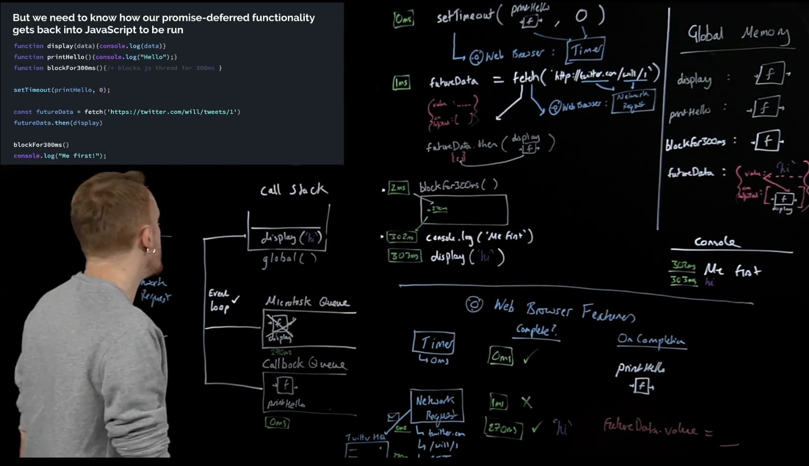

# JS and the Browser

## Asynchronicity in Javascript

Javascript is :

- Single threaded (one command runs at a time)
- Synchronously executing(each line is run in order the code appears)

The core javascript engine is composed of 3 main parts:

- Thread of execution
- Memory/variable environment
- Call Stack

To allow asynchronous behaviors, we need to add some new components:

- Web Browser APIs/Node background APIs (document, fetch, setTimeout,... )
- Promises
- Event Loop, Callback/Task queue and micro task queue
  
## Web API Rules

We need to know when the browser can add something to the main thread JS call stack. A strict set of rules needs to exist to handle these cases.

Browser feature are added to a **callback queue**. They are allowed to run and be put on the call stack only when all the synchronous code in the main thread is done (The global execution context needs to be done).

```js
function printHello(){console.log("Hello")}
function blockForOneSec(){
    // Block js thread for 1 sec (big for loop,...)
}
setTimeout(printHello,0)
blockForOneSec()
console.log("Me First")
```

This timeline for this code block would be this :

- 0ms: blockForOneSec()
- 1000ms: "Me First"
- 1001ms: "Hello"

The feature responsible of checking very quickly if there is anything on the **call stack** and in the **callback queue** is known as the **Event Loop**.

Problem with this approach:

- Our response data is only available in the callback function (callback hell)
- a bit odd to pass a function into another function to finally be run much later if the main thread is busy

## Microtask Queue

> Functions in the `onFulfillment` or `onRejection` array of a Promise don't go to the regular callback queue, they enter their own microtask queue.



In the end, the priority of execution for an asynchronous piece of javascript used in a browser is the following.

- global scope code in the **call stack**
- Then, the **event loop** add events from these queue to the call stack :
  - **microTask queue** events (ES6 Promise based function, for example `.then(function)`)
  - **callback queue** (ES5 javascript callback functions, for example `SetTimeout(function,0)`)
